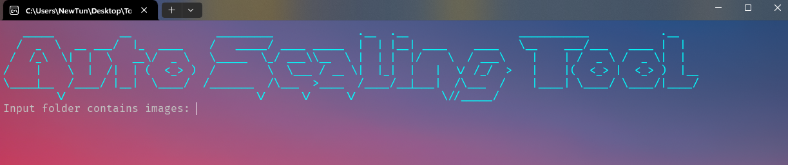

  

  <h3 style="color: red;">Auto Scaling Image Tool</h3>

  

    🖼️A great automatic image enhancement tool🖼️
     
    <a href="./Scale/">Source code</a>
    ·
    <a href="https://github.com/othneildrew/Best-README-Template/issues/new?labels=bug&template=bug-report---.md">Demo</a>
    ·
    <a href="https://github.com/othneildrew/Best-README-Template/issues/new?labels=enhancement&template=feature-request---.md">Download</a>
  

<!-- TABLE OF CONTENTS -->

  
Table of Contents

  <ol>
    <li>
      <a href="#about-the-project">About The Project</a>
      <ul>
        <li><a href="#built-with">Built With</a></li>
        <li><a href="#demo">Demo</a></li>
      </ul>
    </li>
    <li>
      <a href="#getting-started-with-source-code">Getting Started With Source Code</a>
      <ul>
        <li><a href="#prerequisites">Prerequisites</a></li>
      </ul>
    </li>
  </ol>

<!-- ABOUT THE PROJECT -->

## About The Project

This tool helps to automatically upload images and upscale them automatically on the website <a src="https://www.iloveimg.com/upscale-image">iloveimg</a> instead of having to upload up to 3 images each time we upscale, then click the download button which is time-consuming.

This tool has shortened the process, specifically just select the folder containing the images, select the folder to save the images after upscaling, select the scale level and finally wait until all the images are upscaled and downloaded.

(<a href="#readme-top">back to top</a>)

### Built With

This tool is built by C# console.
We only need:   

(<a href="#readme-top">back to top</a>)

### Demo

- Setup

- Upload

- Save

## Getting Started With Source Code

### Prerequisites
This is small basic tool. You only need

* [![Visual Studio][VisualStudioBadge]][VisualStudioURL]
* [![C#][CSharpBadge]][CSharpURL]
* [![.NET Core][DotNetCoreBadge]][DotNetCoreURL]

[VisualStudioBadge]: https://img.shields.io/badge/IDE-Visual_Studio-purple.svg?logo=visual-studio&style=for-the-badge&logo=nextdotjs&logoColor=white&labelColor=fecaca
[VisualStudioURL]: https://visualstudio.microsoft.com/

[CSharpBadge]: https://img.shields.io/badge/Language-C%23_12-239120.svg?logo=c-sharp&style=for-the-badge&labelColor=bbf7d0
[CSharpURL]: https://learn.microsoft.com/en-us/dotnet/csharp/

[DotNetCoreBadge]: https://img.shields.io/badge/NET_Core_8.0-blueviolet.svg?logo=dotnet&style=for-the-badge
[DotNetCoreURL]: https://dotnet.microsoft.com/
