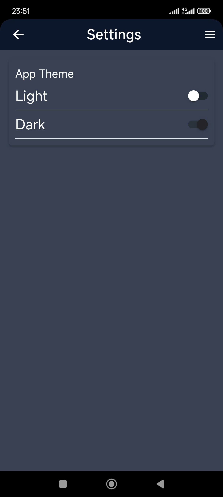

<div align="center" id="readme-top">
  <a align="center" href="https://github.com/othneildrew/Best-README-Template">
    
  </a>

  <h3 align="center" style="color: red;">Password managemnet tool</h3>

  <p align="center">
    🖼️This tool will help you remember all your secure passwords🖼️
    <br />
    <a href="./password-management/">Source code</a>
    ·
    <a href="#demo">Demo</a>
  </p>
</div>

<!-- TABLE OF CONTENTS -->
<details>
  <summary>Table of Contents</summary>
  <ol>
    <li>
      <a href="#about-the-project">About The Project</a>
      <ul>
        <li><a href="#built-with">Built With</a></li>
        <li><a href="#demo">Demo</a></li>
      </ul>
    </li>
    <li>
      <a href="#getting-started-with-source-code">Getting Started With Source Code</a>
      <ul>
        <li><a href="#prerequisites">Prerequisites</a></li>
        <li><a href="#steps">Steps</a></li>
      </ul>
    </li>
  </ol>
</details>

<!-- ABOUT THE PROJECT -->

## About The Project

<div>
    </img>
</div>

<p>Every person has at least 3 accounts, such as Facebook, Google,... If someone is safe, they will have another password with every account. There are a lot of passwords; you can't remember all if you do not have a good brain like me. So, this tool will help you to do this.</p>

<p>
Simply put, the data will be stored in your cloud storage, not mine; the data belongs entirely to you; you can control, view, or delete the data whenever you want.
</p>

<p align="right">(<a href="#readme-top">back to top</a>)</p>

### Built With

-   

-   

<p align="right">(<a href="#readme-top">back to top</a>)</p>

### Demo

<div>
    </img>
    </img>
    </img>
    </img>
    </img>
</div>

## Getting Started With Source Code

### Prerequisites

This is small basic tool. You only need

-   [![Visual Studio Code][VisualStudioCodeBadge]][VisualStudioCodeURL]
-   [![TypeScript][TypeScriptBadge]][TypeScriptURL]
-   [![Ionic][IonicBadge]][IonicURL]

[VisualStudioCodeBadge]: https://img.shields.io/badge/IDE-Visual_Studio_Code-blue?logo=visual-studio-code&style=for-the-badge&logo=nextdotjs&logoColor=white&labelColor=fecaca
[VisualStudioCodeURL]: https://code.visualstudio.com/
[TypeScriptBadge]: https://img.shields.io/badge/TypeScript-239120.svg?logo=typescript&style=for-the-badge&labelColor=bbf7d0
[TypeScriptURL]: https://www.typescriptlang.org/
[IonicBadge]: https://img.shields.io/badge/Ionic_8.0-blue.svg?logo=ionic&style=for-the-badge
[IonicURL]: https://ionicframework.com/

### Steps
- Create a project in <a src="https://console.firebase.google.com/">Firebase Console</a> and add the android app to get service.json
- Then config the environment.ts
- run in web
```
npm i
ionic server
```
- run in android with <a src="https://developer.android.com/studio">Android Studio</a>
```
npm i
ionic capacitor open android
```